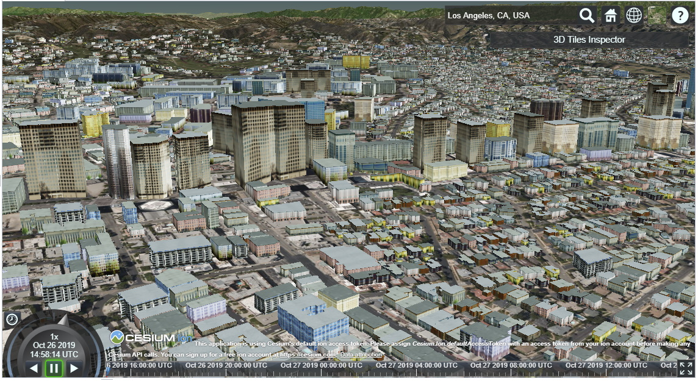

# Generating 3D Tiles with osgEarth



osgearth_3d_tiles is a tool that can help you generate [3D Tiles](https://github.com/AnalyticalGraphicsInc/3d-tiles) datasets using osgEarth's powerful feature rendering engine.  3D Tiles datasets generated by osgEarth can then be rendered using any 3D Tiles compatible renderer including [Cesium](https://cesiumjs.org).


# Building 3D Tiles from an MBTiles database.
osgearth_3d_tiles can be used to generate massive 3d tiles from a tiled mercator mbtiles dataset containing features stored in the Mapnik Vector Tiles format.

##  Tile your features
Build a tiled, mercator mbtiles dataset that only contains data at a single level, like LOD 14.  You probably want to use  [tippecanoe](https://github.com/mapbox/tippecanoe)

##  Develop your earth file 
Create an earth file containing a single feature source with all the styling you want to use.  For example, assuming your mbtiles only contains buildings from OpenStreetMap, here is an earth file that will render textured, extruded buildings which will call buildings.earth.
```xml
<map>
	<MVTFeatures name="data:osm">
		<url>buildings.mbtiles</url>
		<min_level>14</min_level>
		<max_level>14</max_level>
	</MVTFeatures>

	<FeatureModel name="OSM">
	    <merge_geometry>true</merge_geometry>
		<features>data:osm</features>
		<feature_indexing enabled="false"></feature_indexing>
	</FeatureModel>

	<Styles>
		<library name="us_resources">
			<url>../data/resources/textures_us/catalog.xml</url>
		</library>
		<style type="text/css">
			buildings {
			extrusion-height:      getBuildingHeight();
			extrusion-flatten:     true;
			extrusion-wall-style:  building-wall;
			extrusion-roof-style:  building-rooftop;
			}

			building-wall {
			skin-library:     us_resources;
			skin-tags:        building;
			skin-random-seed: 1;
			fill:             #ffffff;
			}
			building-rooftop {
			skin-library:     us_resources;
			skin-tags:        rooftop;
			skin-tiled:       true;
			skin-random-seed: 1;
			fill:             #ffffff;
			}
		</style>

		<script language="javascript">
			<![CDATA[

			function getName() {
			if ("name" in feature.properties) {
			return feature.properties["name"];
			}
			return "";
			}

			function getBuildingHeight() {
			if ("height" in feature.properties) {
			var h = feature.properties["height"].replace('m','');
			return Math.max(h, 4.0);
			} else if ("building:height" in feature.properties) {
			var h = feature.properties["building:height"].replace('m','');
			return Math.max(h, 4.0);
			} else if ("building:levels" in feature.properties){
			var l = feature.properties["building:levels"];
			return Math.max(l * 4.0, 4.0);
			}
			return Math.floor((Math.random() * 5.0) + 4.0);
			}
			]]>
		</script>
	</Styles>    
</map>
```

## Build the leaves 
First, you need to build the leaf nodes of your 3d tiles dataset.  These nodes will line up one to one with the tiles in your mbtiles database.  So if you have 1000 tiles in your database you'll end up with 1000 b3dm files on disk.  

```
osgearth_3dtiles --build_leaves --style buildings --numThreads 8 --in buildings.earth --out 
output\tileset.json --format b3dm
```

This operation is massively parallel and will use the number of threads specified in --numThreads.

## Generate higher level tilesets
Now we need to generate a tileset hierarchy that will efficiently stream in the b3dm files we just generated.  First, we need to collect an index of the b3dm files we just generated.
On Windows
```
cd output
dir *.b3dm /S /B > b3dms.txt
```
On Linux
```
cd output
find . - type f - name "*.b3dm"
```

Now generate the tilesets
```
osgearth_3dtiles --build_tilesets --dataFiles output\b3dms.txt --path /full/path/to/output --out output\tileset.json
```

This should be a fairly fast operation and when it's completed you'll have a root level tileset.json file that you can load into Cesium!
